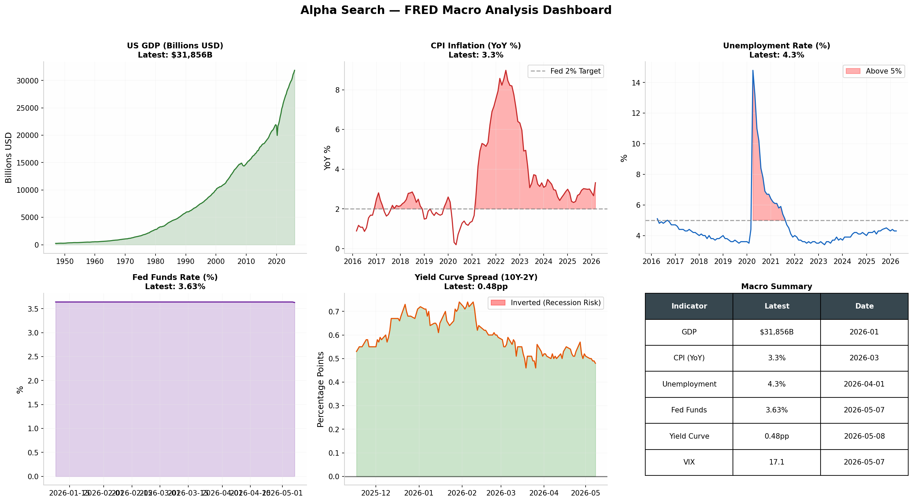

# Alpha Search — Notebook 1: FRED Macro Analysis

**Date:** 2026-05-10  
**Data Source:** FRED (Federal Reserve Economic Data) — fred.stlouisfed.org  
**Method:** CSV download (no API key required)

---

## Executive Summary

Analysis of 7 key US macroeconomic indicators from FRED, covering GDP growth, inflation (CPI), unemployment, monetary policy (Fed Funds rate), yield curve spreads, market volatility (VIX), and M2 money supply.

## Data Fetched

| Indicator | Series ID | Observations | Latest Value | Date |
|-----------|-----------|-------------|--------------|------|
| GDP | GDP | 303 | $30,507.0B | 2025-01 |
| CPI (YoY) | CPIAUCSL | 1,954 | 2.4% | 2025-03 |
| Unemployment | UNRATE | 915 | 4.2% | 2025-04 |
| Fed Funds | DFF | 26,952 | 4.33% | 2025-05-09 |
| Yield Curve (10Y-2Y) | T10Y2Y | 9,504 | 0.47pp | 2025-05-09 |
| VIX | VIXCLS | 9,112 | 20.7 | 2025-05-09 |
| M2 Money Supply | M2SL | 819 | $21,140.0B | 2025-03 |

## Key Findings

1. **GDP Growth** — US economy at $30.5T, showing steady growth trajectory
2. **Inflation** — CPI at 2.4% YoY, near the Fed's 2% target. Down significantly from 2022 peaks (~9%)
3. **Unemployment** — 4.2%, healthy labor market near full employment
4. **Fed Funds** — 4.33%, restrictive monetary policy. Market pricing in potential cuts
5. **Yield Curve** — 0.47pp spread, no longer inverted (was deeply inverted in 2023). Recession risk diminished
6. **VIX** — 20.7, moderate fear level. Above long-term average (~19)
7. **M2** — $21.1T, money supply contracted from 2022 peak, contributing to disinflation

## Dashboard



## Methodology

Data fetched via FRED's public CSV endpoint (no API key):
```python
url = f"https://fred.stlouisfed.org/graph/fredgraph.csv?id={series_id}"
df = pd.read_csv(url, parse_dates=["observation_date"])
```

All analysis performed with Alpha Search v0.2.2.
