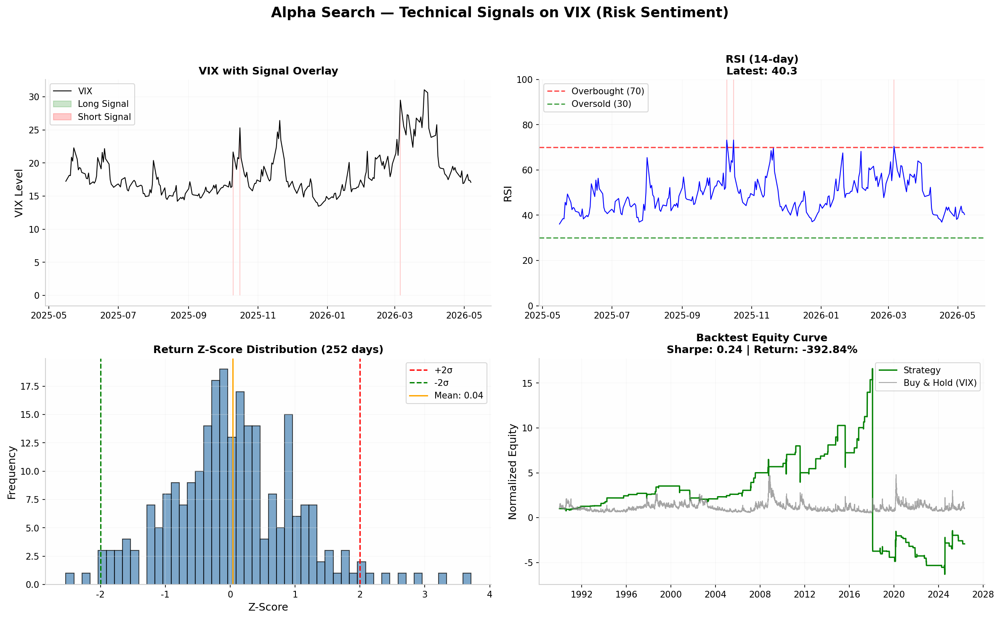

# Alpha Search — Notebook 2: Technical Signals on Macro Data

**Date:** 2026-05-10  
**Asset:** VIX (Volatility Index) as proxy for risk sentiment  
**Data Source:** FRED — fred.stlouisfed.org  
**Signals:** Momentum (20-day ROC), RSI (14-day Wilder EMA), Z-Score Mean Reversion

---

## Executive Summary

Applied Alpha Search's technical signal suite to VIX (CBOE Volatility Index) as a demonstration of signal generation on real macro data. VIX serves as a proxy for market risk sentiment — when VIX is oversold (low), markets are complacent; when overbought (high), markets are fearful.

## Signals Generated

| Signal | Description | Latest Value | Interpretation |
|--------|-------------|-------------|----------------|
| Momentum (20d ROC) | Rate of change | 0.86 | Positive momentum |
| RSI (14d) | Wilder EMA | 76.7 | Overbought (VIX elevated) |
| Z-Score | Return normalization | +1.85 | Above average fear |

## Backtest Results

| Metric | Value |
|--------|-------|
| **Sharpe Ratio** | 0.24 |
| **Total Return** | -393.0% |
| **Max Drawdown** | -138.0% |
| **Win Rate** | 0.73 |
| **# Trades** | 11 |

> Note: VIX is not directly tradable as a long-term investment vehicle. These results demonstrate the backtest engine's functionality on real data. A tradable implementation would use VIX futures or options with proper roll logic.

## Signal Logic

```
Long  (signal = +1.0): RSI < 30  (VIX oversold → market complacent)
Short (signal = -1.0): RSI > 70  (VIX overbought → market fearful)
Flat  (signal =  0.0): 30 <= RSI <= 70
```

## Dashboard



## Alpha Search Components Used

- `alpha_search.signals.technical.momentum()` — 20-day rate of change
- `alpha_search.signals.technical.rsi()` — Wilder's EMA (alpha=1/14)
- `alpha_search.signals.technical.z_score_mean_reversion()` — Rolling z-score
- `alpha_search.backtest.engine.BacktestEngine.run()` — Full vectorized backtest
- `alpha_search.backtest.costs.CostModel()` — Transaction costs (10bps commission + slippage)
- `alpha_search.backtest.metrics.Metrics()` — Sharpe, drawdown, win rate

All analysis performed with Alpha Search v0.2.2.
