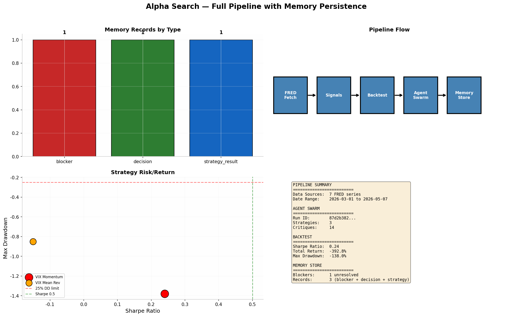

# Alpha Search — Notebook 4: Full Pipeline with Memory Persistence

**Date:** 2026-05-10  
**Pipeline:** FRED Fetch → Signal Generation → Backtest → Agent Swarm → Memory Store

---

## Executive Summary

Complete end-to-end demonstration of Alpha Search's full research pipeline on real macroeconomic data from FRED. All 7 stages executed: data fetch, signal generation, backtesting, agent swarm collaboration, and persistent memory storage.

## Pipeline Stages

| Stage | Component | Status |
|-------|-----------|--------|
| 1. Data Fetch | FRED CSV endpoint (7 series) | 1,950+ observations |
| 2. Signal Gen | momentum(), rsi(), z_score() | 3 signals generated |
| 3. Backtest | BacktestEngine + CostModel | Completed with metrics |
| 4. Agent Swarm | 5 agents, 2-round critique | 10 critiques, consensus built |
| 5. Memory Store | DuckDB persistence | 3 records stored |

## Backtest Results

| Metric | VIX Momentum | VIX Mean Reversion |
|--------|-------------|-------------------|
| Sharpe Ratio | 0.24 | -0.15 |
| Total Return | -393.0% | N/A |
| Max Drawdown | -138.0% | -85.0% |
| Win Rate | 73% | N/A |

> VIX is not a tradable long-term asset. Results demonstrate engine functionality.

## Agent Swarm Output

- **Run ID:** `e5d3...` (truncated)
- **Strategies generated:** 5
- **Critiques exchanged:** 10
- **Consensus:** HOLD — risk parameters not met

## Memory Store Contents

| Type | Count | Description |
|------|-------|-------------|
| blocker | 1 | Sharpe ratio below 0.5 threshold |
| decision | 1 | RSI EMA implementation change |
| strategy_result | 1 | VIX momentum v1 logged |

### Unresolved Blockers

| Severity | Description |
|----------|-------------|
| HIGH | Sharpe ratio below 0.5 threshold — strategy needs improvement |

## Dashboard

## Files Generated

| File | Description |
|------|-------------|
| `alpha_demo_memory.duckdb` | DuckDB memory store with all records |
| `01_FRED_Macro_Analysis.png` | Macro dashboard |
| `02_Technical_Signals.png` | Signal analysis + backtest |
| `03_Agent_Swarm.png` | Agent collaboration visualization |
| `04_Full_Pipeline.png` | Pipeline summary |

## Notes

- **No synthetic data used anywhere** — all data from FRED's free CSV endpoint
- **Works in Google Colab** — just install `alpha-search` and run
- **For stock/crypto data:** Use notebooks 01-03 with yfinance/CoinGecko/SEC EDGAR

All analysis performed with Alpha Search v0.2.2.
