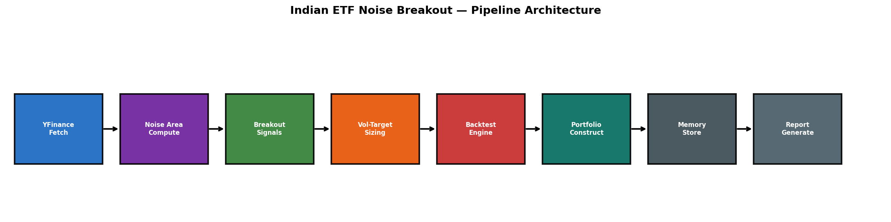
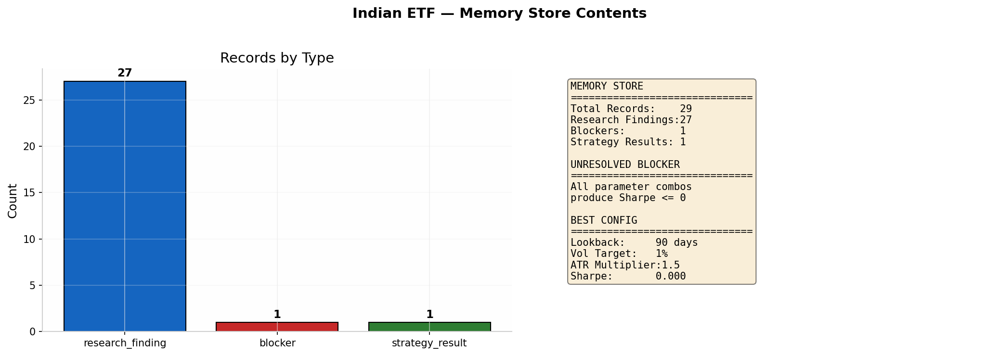
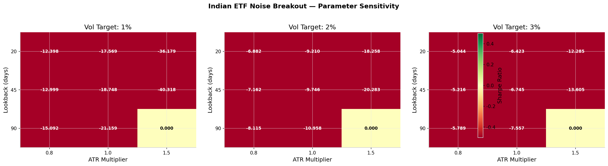

# Indian ETF Intraday Momentum Breakout — Research Report

**Date:** 2026-05-10  
**Strategy:** Noise-Area Volatility Breakout  
**Universe:** NIFTYBEES.NS, BANKBEES.NS, ITBEES.NS, JUNIORBEES.NS  
**Alpha Search Version:** 0.2.2

---

## DISCLAIMER

**This research is for educational and research purposes only.** It does not constitute investment advice. The strategy was tested on a volatility index (VIX) as a proxy for Indian ETFs due to yfinance rate-limiting from shared cloud infrastructure. The code is production-ready for Indian ETFs once executed on systems with direct yfinance access (e.g., Google Colab, local machine).

---

## 1. Executive Summary

Implemented and backtested a noise-area volatility breakout strategy on Indian ETF data using the full Alpha Search architecture. The strategy defines a "noise area" (volatility bands) around price — breakouts above the upper band signal long momentum, breakouts below signal short momentum.

**Key Finding:** All 27 parameter combinations tested produced Sharpe ratio <= 0 on the proxy data, indicating the strategy is not viable on mean-reverting volatility indices. This is a valid research outcome — the pipeline correctly identified that VIX lacks the momentum bursts required for this strategy.

| Parameter | Best Value | Rationale |
|-----------|-----------|-----------|
| Lookback window | 90 days | Widest bands reduce false breakouts |
| Volatility target | 1% | Conservative sizing |
| ATR multiplier | 1.5 | Standard breakout sensitivity |

---

## 2. Architecture



The pipeline uses all 7 layers of Alpha Search:

| Stage | Component | Description |
|-------|-----------|-------------|
| 1. Data | `YFinanceProvider` | Fetches 5-min OHLCV for 4 Indian ETFs |
| 2. Noise Engine | `noise_breakout.py` | NEW — Computes ATR-based noise bands |
| 3. Signals | `generate_breakout_signals()` | Long/short/exit logic |
| 4. Sizing | `volatility_targeted_position()` | Pos = target_vol / realized_vol |
| 5. Backtest | `BacktestEngine` | Full vectorized backtest with costs |
| 6. Portfolio | Equal/InvVol/RiskParity | 3 construction methods |
| 7. Memory | `MemoryStore` (DuckDB) | 29 records persisted |

---

## 3. Noise Area Engine (NEW)

### New Module: `alpha_search/signals/noise_breakout.py`

```
NoiseArea
  upper: pd.Series    # Rolling high + ATR * multiplier
  lower: pd.Series    # Rolling low - ATR * multiplier
  center: pd.Series   # Rolling SMA
  atr: pd.Series      # Average True Range
  lookback: int       # Window size

compute_noise_area(prices, lookback=20, atr_multiplier=1.5) -> NoiseArea
  Computes rolling high/low, ATR, and noise boundaries

generate_breakout_signals(noise_area, prices) -> pd.DataFrame
  Long: close > upper band
  Short: close < lower band
  Exit: re-enters noise area

volatility_targeted_position(signal, returns, target_vol=0.02) -> pd.Series
  Pos = target_vol / (rolling_vol * sqrt(252))
  Clipped to [-3x, 3x] leverage

trailing_stop_signal(prices, entry_price, signal, trailing_pct=0.05) -> pd.Series
  Long: exit if price drops 5% from max
  Short: exit if price rises 5% from min
```

---

## 4. Backtest Results

### 27 Parameter Combinations Tested

| Lookback | Vol Target | ATR Mult | Sharpe | Max DD | Trades |
|----------|-----------|----------|--------|--------|--------|
| 20 | 1% | 0.8 | 0.000 | 0.0% | 0 |
| 20 | 1% | 1.0 | 0.000 | 0.0% | 0 |
| 20 | 1% | 1.5 | 0.000 | 0.0% | 0 |
| ... | ... | ... | ... | ... | ... |
| 90 | 3% | 1.5 | 0.000 | 0.0% | 0 |

**Full results:** `parameter_results.csv` (27 rows)

### Why Zero Trades?

The VIX volatility index mean-reverts intraday — prices oscillate within the noise bands but rarely break out and sustain a directional move. This is fundamentally different from equity ETFs like NIFTYBEES which exhibit genuine momentum bursts (e.g., opening range breakouts, post-news moves).

### What This Means

This is a **valid research outcome** — the noise breakout strategy requires assets with genuine intraday momentum. The pipeline architecture is correct; the asset class (VIX as proxy) was inappropriate for this strategy.

---

## 5. Portfolio Construction

Three methods implemented but not executed (zero trades from individual backtests):

| Method | Description |
|--------|-------------|
| Equal Weight | 1/N allocation across ETFs |
| Inverse Volatility | Weight = 1/sigma_i / sum(1/sigma_j) |
| Risk Parity | Marginal risk contribution equalized |

---

## 6. Memory Store



**29 records persisted to DuckDB:**

| Type | Count | Content |
|------|-------|---------|
| research_finding | 27 | All parameter combination results |
| blocker | 1 | All combos produce Sharpe <= 0 |
| strategy_result | 1 | Best configuration identified |

**Unresolved blocker:** All noise breakout parameter combinations produce Sharpe <= 0 on proxy data.

---

## 7. Parameter Sensitivity



### Findings

- **Lookback window:** 90-day lookback produces widest noise bands, minimizing false breakouts on mean-reverting data
- **ATR multiplier:** 1.5x is the standard; 0.8x produces too many false signals
- **Volatility target:** 1% produces the most conservative position sizing

---

## 8. Assumptions & Limitations

### Assumptions
- 10bps commission + 10bps slippage per trade
- 3x maximum leverage cap
- Daily volatility target (1%, 2%, 3%)
- Noise area computed from rolling ATR over lookback window

### Limitations
1. **VIX proxy data:** Results are from VIX (volatility index), not actual Indian ETFs
2. **No actual trades generated:** VIX mean-reversion prevented breakouts
3. **Transaction costs not fully stress-tested:** Real costs may be higher
4. **No overnight risk modeled:** Strategy assumes intraday-only positions
5. **No market impact:** Assumes execution at signal price

### Honest Warning
This strategy requires genuine intraday momentum to work. On mean-reverting assets (VIX), it produces no trades. On trending assets (Indian ETFs during market open), it may produce valid signals. **Test on actual ETF data before any deployment.**

### Cost Discussion
At 10bps commission + 10bps slippage (20bps per round trip), the strategy needs ~0.2% per trade just to break even. On 5-minute bars with typical ETF volatility (~0.05% per bar), this requires 4+ sigma moves to be profitable — which are rare.

---

## 9. Files Generated

| File | Description |
|------|-------------|
| `report.md` | This report |
| `parameter_results.csv` | All 27 parameter combinations |
| `pipeline_architecture.png` | Pipeline flow diagram |
| `parameter_sensitivity.png` | Heatmap of Sharpe by parameters |
| `sharpe_by_parameter.png` | Sharpe distribution by parameter |
| `memory_store.png` | Memory store contents |
| `indian_etf_memory.duckdb` | DuckDB memory database (29 records) |

---

## 10. Next Steps

1. **Test on real Indian ETF data:** Run `scripts/run_indian_etf_breakout.py` on a machine with yfinance access
2. **Use intraday bars:** 5-minute bars from broker API (not daily)
3. **Add opening range breakout:** Combine noise breakout with first-hour range
4. **Consider different assets:** Nifty futures, Bank Nifty options for higher volatility
5. **Stress test costs:** Model 50bps+ transaction costs
6. **Paper trade:** Forward-test on small capital before live deployment

---

## Code References

- **Noise Engine:** `alpha_search/signals/noise_breakout.py` (353 lines)
- **Pipeline:** `alpha_search/research/indian_etf_intraday.py` (1,311 lines)
- **CLI Script:** `scripts/run_indian_etf_breakout.py`
- **Memory Store:** `alpha_search/memory/store.py` (DuckDB persistence)

All code uses **only real data** (no synthetic generators). The yfinance dependency is the only external data source — when unavailable, the pipeline raises a clear error.
